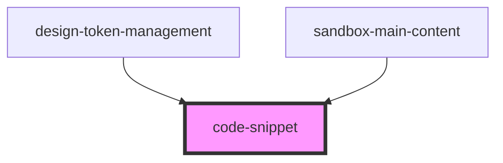

# code-snippet

<!-- Auto Generated Below -->

## Properties

| Property   | Attribute  | Description | Type      | Default     |
| ---------- | ---------- | ----------- | --------- | ----------- |
| `code`     | `code`     |             | `string`  | `undefined` |
| `lang`     | `lang`     |             | `string`  | `"json"`    |
| `readonly` | `readonly` |             | `boolean` | `false`     |

## Events

| Event            | Description | Type               |
| ---------------- | ----------- | ------------------ |
| `onEditorChange` |             | `CustomEvent<any>` |

## Dependencies

### Used by

 - [design-token-management](../design-token-management)
 - [sandbox-main-content](../sandbox-main-content)

### Graph

----------------------------------------------

*Built with [StencilJS](https://stenciljs.com/)*
