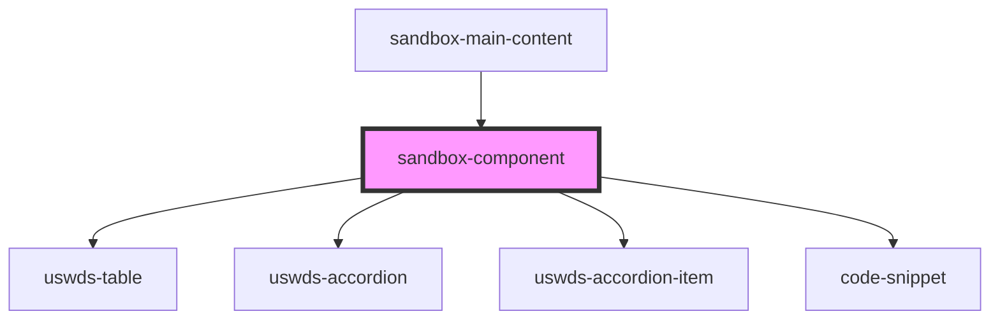

# sandbox-component

<!-- Auto Generated Below -->

## Properties

| Property    | Attribute | Description | Type                   | Default     |
| ----------- | --------- | ----------- | ---------------------- | ----------- |
| `component` | --        |             | `SandboxComponentItem` | `undefined` |

## Dependencies

### Used by

 - [sandbox-main-content](../sandbox-main-content)

### Depends on

- [uswds-table](../uswds-table)
- [uswds-accordion](../uswds-accordion)
- [uswds-accordion-item](../uswds-accordion-item)
- [code-snippet](../code-snippet)

### Graph

----------------------------------------------

*Built with [StencilJS](https://stenciljs.com/)*
