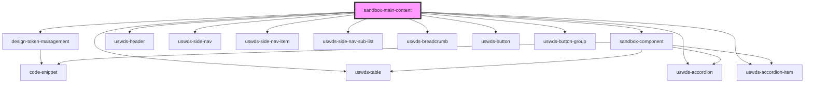

# sandbox-main-content

<!-- Auto Generated Below -->

## Dependencies

### Depends on

- [design-token-management](../design-token-management)
- [sandbox-component](../sandbox-component)
- [uswds-header](../uswds-header)
- [uswds-side-nav](../uswds-side-nav)
- [uswds-side-nav-item](../uswds-side-nav-item)
- [uswds-side-nav-sub-list](../uswds-side-nav-sub-list)
- [uswds-accordion](../uswds-accordion)
- [uswds-accordion-item](../uswds-accordion-item)
- [uswds-table](../uswds-table)
- [uswds-breadcrumb](../uswds-breadcrumb)
- [uswds-button](../uswds-button)
- [uswds-button-group](../uswds-button-group)

### Graph

----------------------------------------------

*Built with [StencilJS](https://stenciljs.com/)*
