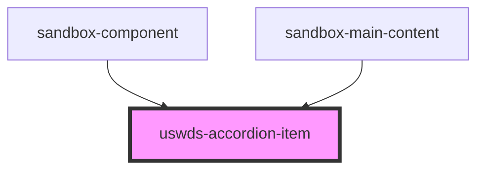

# uswds-accordion-item

<!-- Auto Generated Below -->

## Properties

| Property   | Attribute  | Description | Type      | Default     |
| ---------- | ---------- | ----------- | --------- | ----------- |
| `expanded` | `expanded` |             | `boolean` | `false`     |
| `header`   | `header`   |             | `string`  | `undefined` |

## Dependencies

### Used by

 - [sandbox-component](../sandbox-component)
 - [sandbox-main-content](../sandbox-main-content)

### Graph

----------------------------------------------

*Built with [StencilJS](https://stenciljs.com/)*
