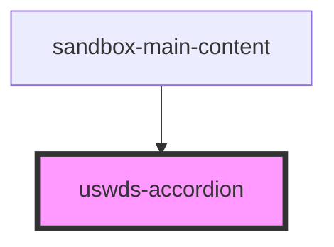

# uswds-accordion

<!-- Auto Generated Below -->

## Properties

| Property        | Attribute        | Description | Type                                                                            | Default        |
| --------------- | ---------------- | ----------- | ------------------------------------------------------------------------------- | -------------- |
| `accordionType` | `accordion-type` |             | `"bordered" \| "borderless" \| "multiselectable" \| "multiselectable-bordered"` | `'borderless'` |

## Dependencies

### Used by

 - [sandbox-main-content](../sandbox-main-content)

### Graph

----------------------------------------------

*Built with [StencilJS](https://stenciljs.com/)*
