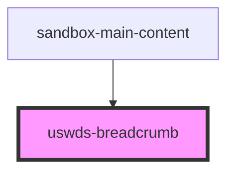

# uswds-breadcrumb

<!-- Auto Generated Below -->

## Properties

| Property      | Attribute    | Description | Type               | Default     |
| ------------- | ------------ | ----------- | ------------------ | ----------- |
| `ariaLabel`   | `aria-label` |             | `string`           | `undefined` |
| `breadcrumbs` | --           |             | `BreadcrumbItem[]` | `[]`        |

## Dependencies

### Used by

 - [sandbox-main-content](../sandbox-main-content)

### Graph

----------------------------------------------

*Built with [StencilJS](https://stenciljs.com/)*
