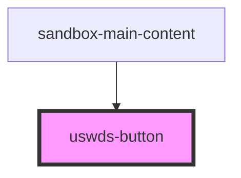

# uswds-button

<!-- Auto Generated Below -->

## Properties

| Property   | Attribute  | Description | Type                                                                                | Default     |
| ---------- | ---------- | ----------- | ----------------------------------------------------------------------------------- | ----------- |
| `big`      | `big`      |             | `boolean`                                                                           | `false`     |
| `inverse`  | `inverse`  |             | `boolean`                                                                           | `false`     |
| `type`     | `type`     |             | `"accent-cool" \| "accent-warm" \| "base" \| "default" \| "outline" \| "secondary"` | `'default'` |
| `unstyled` | `unstyled` |             | `boolean`                                                                           | `false`     |

## Dependencies

### Used by

 - [sandbox-main-content](../sandbox-main-content)

### Graph

----------------------------------------------

*Built with [StencilJS](https://stenciljs.com/)*
