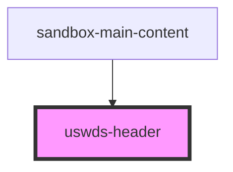

# uswds-header

<!-- Auto Generated Below -->

## Properties

| Property       | Attribute       | Description | Type              | Default           |
| -------------- | --------------- | ----------- | ----------------- | ----------------- |
| `enableSearch` | `enable-search` |             | `boolean`         | `true`            |
| `headerTitle`  | `header-title`  |             | `string`          | `'Project Title'` |
| `navItems`     | --              |             | `HeaderNavItem[]` | `[]`              |

## Dependencies

### Used by

 - [sandbox-main-content](../sandbox-main-content)

### Graph

----------------------------------------------

*Built with [StencilJS](https://stenciljs.com/)*
